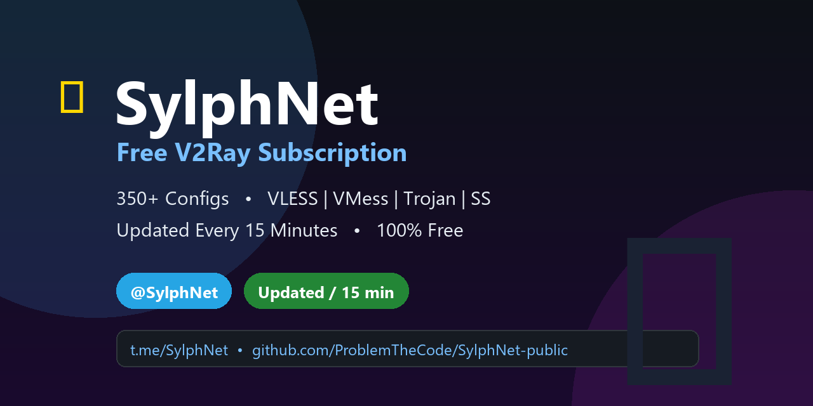

<div align="center">



**🌐 [Official Website](https://problemthecode.github.io/SylphNet-public/) • 💬 [Telegram @SylphNet](https://t.me/SylphNet) • 📡 [Get Subscription](#-subscription-link)**

</div>

<div align="center">


### Fast • Fresh • Free — Updated Every 15 Minutes


**[📥 GET SUBSCRIPTION](#-subscription-link)** • **[📱 HOW TO USE](#-how-to-use)** • **[❓ FAQ](#-faq)**

</div>

---

## 📡 Subscription Link

> **Copy the link below and add it to your VPN client as a Subscription:**

```
https://raw.githubusercontent.com/ProblemTheCode/SylphNet-public/refs/heads/main/sub/sub.txt
```

<details>
<summary>🔗 Plain text version (for manual import)</summary>

```
https://raw.githubusercontent.com/ProblemTheCode/SylphNet-public/refs/heads/main/sub/sub_plain.txt
```

</details>

---

## 📱 How to Use

<table>
<tr><th>Platform</th><th>Recommended Apps</th></tr>
<tr><td><b>🤖 Android</b></td><td>v2rayNG • NekoBox • Hiddify • Husi</td></tr>
<tr><td><b>🍎 iOS</b></td><td>Streisand • Shadowrocket • V2Box • Hiddify</td></tr>
<tr><td><b>🪟 Windows</b></td><td>v2rayN • NekoRay • Hiddify • Furious</td></tr>
<tr><td><b>🐧 Linux</b></td><td>NekoRay • Hiddify • v2rayA</td></tr>
<tr><td><b>🍏 macOS</b></td><td>V2Box • Hiddify • FoXray</td></tr>
</table>

### Quick Setup (v2rayNG example)
1. Open the app → tap **☰** menu → **Subscription**
2. Tap **➕** → paste the link above → **Save**
3. Swipe down / tap **Update subscriptions**
4. Pick a config → **Connect** 🚀

<details>
<summary>📖 Step-by-step for all apps (click to expand)</summary>

**v2rayN (Windows)**
1. Open v2rayN → **Subscription Group** → **Subscription Settings**
2. Click **Add** → paste URL → **Confirm**
3. Press **Ctrl+U** or right-click tray icon → **Update Subscription**

**NekoBox / NekoRay**
1. Menu → **Manage subscriptions** → **New**
2. Paste URL → **OK**
3. Right-click the subscription → **Update**

**Streisand (iOS)**
1. **Home** → **Configs** → **+** → **Add subscription**
2. Paste URL → **Save** → pull-to-refresh

**Hiddify**
1. Tap **+** → **Add from clipboard** (after copying link)
2. Or tap **+** → paste URL directly

</details>

---

## ✨ What You Get

| | |
|---|---|
| 🔄 **Always Fresh** | Subscription refreshes **every 15 minutes** automatically |
| 🌍 **All Protocols** | VLESS, VMess, Trojan, Shadowsocks — all in one sub |
| 🏷️ **Clean Names** | Every config labeled `@SylphNet | Date #N` so you always know it's fresh |
| 📅 **Jalali Date** | Persian calendar in every config name — instantly see the update date |
| 🆓 **100% Free** | No registration, no limits, no ads |

### Naming Format

```
@SylphNet | 1405-06-17 #1
@SylphNet | 1405-06-17 #2
@SylphNet | 1405-06-17 #3
...
```
| Part | Meaning |
|---|---|
| `@SylphNet` | Channel identity — always know the source |
| `1405-06-17` | Jalali (Persian) date of last update |
| `#1, #2, ...` | Config number in this update |

---

## ❓ FAQ

<details>
<summary><b>Configs are not connecting — what should I do?</b></summary>
<br>

- **Update your subscription** — configs refresh every 15 minutes, old ones die fast
- Try a different config from the list (lower numbers = newest batch)
- Switch between WiFi / mobile data — some networks block different servers
- Check that your client app is updated to the latest version

</details>

<details>
<summary><b>How often should I update?</b></summary>
<br>

Your client updates the sub on its own schedule (usually manual or every few hours). For the freshest configs, **update the subscription every time before connecting**. The sub itself refreshes server-side every 15 minutes.

</details>

<details>
<summary><b>Is it really free? What's the catch?</b></summary>
<br>

Yes, 100% free. SylphNet aggregates publicly shared community configs and republishes them with clean, dated naming. No accounts, no tracking, no logs.

</details>

<details>
<summary><b>Which protocol is best for me?</b></summary>
<br>

- **VLESS + TLS** — best all-around, fast and stealthy
- **VMess** — older but very compatible
- **Trojan** — looks like normal HTTPS traffic
- **Shadowsocks** — lightweight, good for mobile

Just connect to any config — your client handles the protocol automatically.

</details>

---

## 📊 Stats

<div align="center">


</div>

---

## ⭐ Support the Project

<div align="center">

**If SylphNet helps you stay connected, please star the repo ⭐ and share the subscription link with friends!**

[](https://github.com/ProblemTheCode/SylphNet-public/stargazers)
[](https://github.com/ProblemTheCode/SylphNet-public/fork)
[](#-subscription-link)

</div>

---

<div align="center">

### 💬 SylphNet Channel

**Join our channel for updates, news and announcements:**

# **[ t.me/SylphNet ](https://t.me/SylphNet)**

[](https://t.me/SylphNet)

---

*Made with ❤️ for a free and open internet — **SylphNet***

</div>
